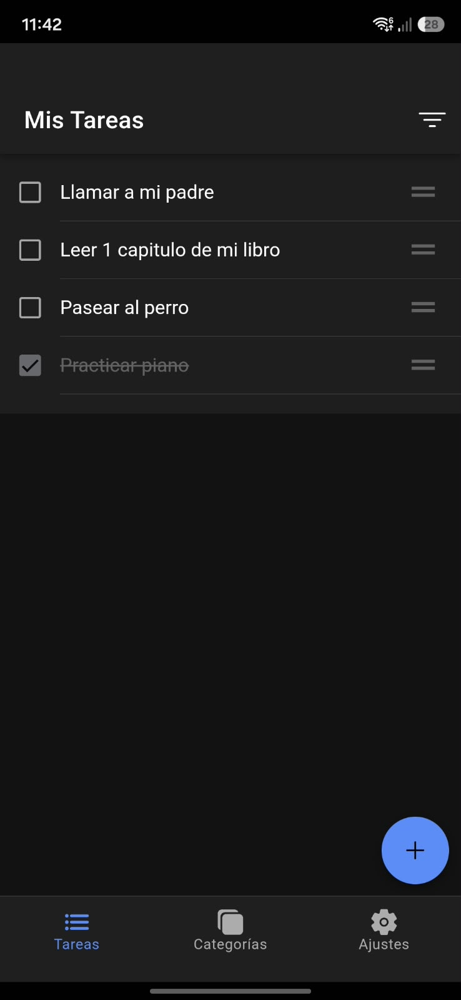
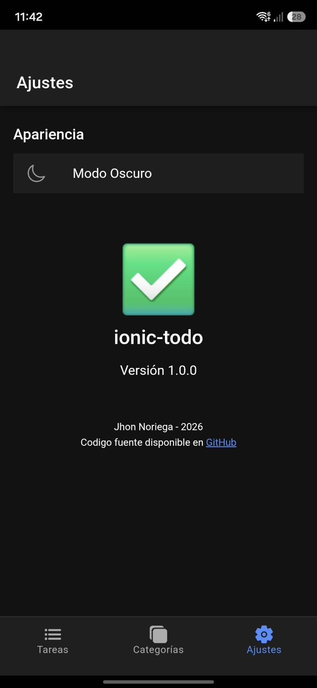

# ionic-todo




## Tabla de contenidos

- [Descripción](#descripción)
- [Tecnologías](#tecnologías)
- [Arquitectura del proyecto](#arquitectura-del-proyecto)
- [Requisitos previos](#requisitos-previos)
- [Cómo ejecutar el proyecto en el navegador](#cómo-ejecutar-el-proyecto-en-el-navegador)
- [Configuración de Firebase](#configuración-de-firebase)
- [Compilación del APK](#compilación-del-apk)
- [Compilación en iOS](#compilación-en-ios)
- [Feature flag de Firebase](#feature-flag-de-firebase)
- [Técnicas de optimización](#técnicas-de-optimización)

## Descripción

Aplicación móvil híbrida desarrollada con Ionic, Angular y Cordova. Permite la gestión de tareas con persistencia de datos local, agrupación por categorías, reordenamiento y modo oscuro.

## Tecnologías

- **Framework:** Ionic v8 / Angular
- **Plataforma nativa:** Apache Cordova
- **Persistencia:** IndexedDB (en navegador) / SQLite (en nativo)
- **Arquitectura:** Feature-based (DDD)
- Android SDK API level 33 (Android 13.0 "Tiramisu")
- Gradle 8.7
- JDK 17.0.20

## Arquitectura del proyecto

Se utilizó una arquitectura basada en features, con cuatro carpetas iniciales dentro de `app` (`core`, `features`, `layout`, `shared`), y dentro de `features` cada feature se divide en tres capas (`data`, `domain` y `presentation`).

**core:** Agrupa funciones de bajo nivel (storage, gestor de tema, abstracción de fetch/axios/httpclient) para cumplir el principio de Inversión de Dependencias, de forma que los módulos de lógica de negocio no dependan directamente de los módulos de bajo nivel. Así se puede cambiar de base de datos o forma de consumir APIs sin tocar nada de las features.

**layout:** Contiene los shells o layouts de la UI. En este caso se usa para envolver las rutas con una barra de tabs para navegar.

**shared:** Contiene componentes y clases que se comparten en toda la aplicación.

**features:** Contiene la lógica de negocio de la aplicación, sus componentes principales, páginas y repositorios. Cada feature se divide en tres capas:

- **feature/presentation:** Almacena los elementos de la UI y la lógica para controlar sus estados. Contiene páginas y componentes.
- **feature/domain:** Contiene los casos de uso, modelos e interfaces propias de la lógica de negocio. Es la carpeta a la que se suelen hacer tests unitarios, ya que ahí está lo fundamental de la lógica de negocio.
- **feature/data:** Hace de puente con los elementos externos y de bajo nivel de la aplicación. Aquí se suelen almacenar repositorios y funciones que conectan con la API y/o la base de datos.

```
src/
├── app/
│   ├── core/
│   ├── layout/
│   ├── shared/
│   ├── features/
│   │   ├── categories/
│   │   │   ├── data/
│   │   │   ├── domain/
│   │   │   └── presentation/
│   │   │
│   │   ├── settings/
│   │   │   └── presentation/
│   │   │
│   │   └── tasks/
│   │       ├── data/
│   │       ├── domain/
│   │       └── presentation/
```

## Requisitos previos

Antes de ejecutar el proyecto, asegúrate de tener instalado:

- **Node.js** (v18 o superior recomendado)
- **Ionic CLI**: `npm install -g @ionic/cli`
- **Cordova CLI**: `npm install -g cordova`
- Para compilar Android: **Java JDK 17.0.20**, **Android SDK API level 33** y **Gradle 8.7**

## Cómo ejecutar el proyecto en el navegador

1. Clonar el repositorio:
   `git clone https://github.com/jhonnoriega1221/ionic-tasks.git`
2. Instalar dependencias:
   `npm install`
3. Ejecutar en el navegador:
   `ionic serve`

## Configuración de Firebase

Este proyecto usa credenciales personales de Firebase, si se quiere probar la feature de las flags se debe configurar una app de firebase con otra cuenta y cambiar la configuracion de firebase en `environment.ts`.

1. Crea un proyecto en [Firebase Console](https://console.firebase.google.com/).
2. Habilita **Remote Config**.
3. Copia tus credenciales de configuración web de Firebase.
4. Colócalas en el archivo de environment correspondiente del proyecto (`src/environments/environment.ts`), siguiendo el mismo formato que usa Firebase al generarlas.
5. Si vas a clonar este repositorio y probarlo, deberás reemplazar esas credenciales por las de tu propio proyecto de Firebase.

## Compilación del APK

### Android

Para la compilación en Android se requiere al menos esto, ya que utiliza Cordova:

- Java JDK: 17.0.20
- Android SDK API level 33 (Android 13.0 "Tiramisu")
- Gradle 8.7

Pasos:

1. Ejecuta: `ionic build`
2. Ejecuta: `cordova platform add android`
3. Ejecuta: `npx cordova build android`
4. El APK estará disponible en `platforms/android/app/build/outputs/apk/debug/app-debug.apk`

## Compilación en iOS

No fue posible generar el archivo IPA ni documentar los pasos de compilación para iOS, ya que este proceso requiere una máquina con macOS y Xcode instalados, y no cuento con acceso a un equipo con ese sistema operativo. La estructura del proyecto es compatible con Cordova para iOS (`cordova platform add ios`), pero la compilación y firma del build quedan pendientes de un entorno macOS.

## Feature flag de Firebase

En Firebase se configuró la app y se agregó el feature flag `enable_task_filter`, el cual muestra y oculta el botón para filtrar la lista de tareas.

## Técnicas de optimización

- Uso de Virtual Scroll para renderizar únicamente los elementos del DOM que son visibles en la pantalla, manteniendo los 60 FPS sin importar cuántas tareas tenga el usuario.
- Lógica de normalización de índices en memoria y actualización en lote en la base de datos local para mantener la coherencia de las posiciones.
- Indicador visual dinámico cuando un filtro está activo (bloqueando el reordenamiento para evitar corrupción de índices).
- Persistencia de la preferencia del usuario mediante `StorageService`.
- Al reordenar la lista, en lugar de hacer un `await` secuencial por cada tarea modificada, se realiza un `Promise.all()` en el `StorageService`. Esto ejecuta las escrituras en IndexedDB de forma concurrente, reduciendo el tiempo de escritura a unos pocos milisegundos.
